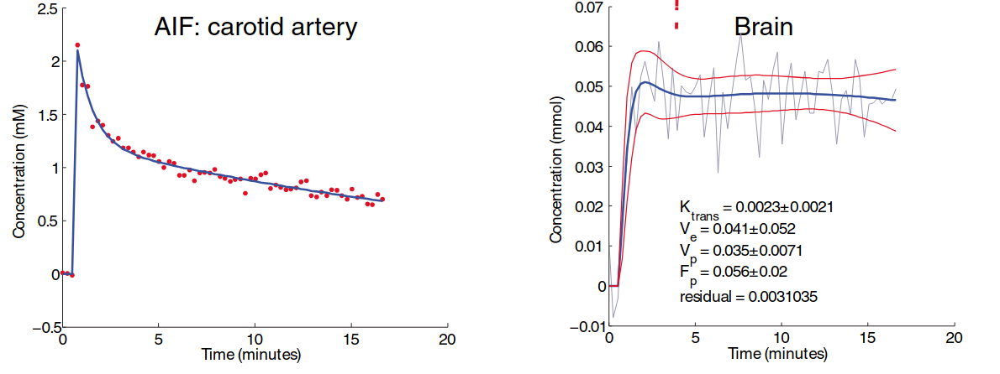

# ROCKETSHIP v2.0.rc
---
[](https://petmri.github.io/ROCKETSHIP/)


ROCKETSHIP is a toolbox for processing and analyzing parametric MRI and DCE-MRI data. It was developed at the Biological Imaging Center at the California Institute of Technology and Loma Linda University.

If you use ROCKETSHIP in your project, please cite:

Ng, T.S.C., et al. [ROCKETSHIP: a flexible and modular software tool for the planning, processing and analysis of dynamic MRI studies](https://doi.org/10.1186/s12880-015-0062-3). *BMC Medical Imaging*, 15, 19 (2015). PMID: 26076957



## Help
For documentation and how-to guides, use the project docs site:

- https://petmri.github.io/ROCKETSHIP/

The GitHub Wiki is being migrated and will be kept for transition notices.


## ROCKETSHIP Papers

If you are using ROCKETSHIP for DCE-MRI, please cite this paper, which also has detailed information about the DCE models used in this project:

Ng, T.S.C., et al. [ROCKETSHIP: a flexible and modular software tool for the planning, processing and analysis of dynamic MRI studies](https://doi.org/10.1186/s12880-015-0062-3). *BMC Medical Imaging*, 15, 19 (2015). PMID: 26076957


If you are pursuing BBB human applications, please also consider:

Barnes, S.R., et al. [Optimal acquisition and modeling parameters for accurate assessment of low Ktrans blood-brain barrier permeability using dynamic contrast-enhanced MRI](https://pubmed.ncbi.nlm.nih.gov/26077645/). *Magnetic Resonance in Medicine*, 75(5), 1967-1977 (2016). PMID: 26077645

Montagne, A., et al. [Blood-brain barrier breakdown in the aging human hippocampus](https://pubmed.ncbi.nlm.nih.gov/25611508/). *Neuron*, 85(2), 296-302 (2015). PMID: 25611508


Other publications using ROCKETSHIP (for a more complete list, see [Google Scholar](https://scholar.google.com/scholar?cites=17209875609254734596&as_sdt=2005&sciodt=0,5&hl=en)):
- Pan, H., et al. [Liganded magnetic nanoparticles for magnetic resonance imaging of α-synuclein](https://doi.org/10.1038/s41531-025-00918-z). *npj Parkinson's Disease*, 11(1), 88 (2025). PMID: 40268938
- Llull, B., et al. [Blood-Brain Barrier Disruption Predicts Poor Outcome in Subarachnoid Hemorrhage: A Dynamic Contrast-Enhanced MRI Study](https://doi.org/10.1161/STROKEAHA.125.051455). *Stroke*, 56(9), 2633-2643 (2025). PMID: 40557536
- Reas, E.T., et al. [APOE ε4-related blood-brain barrier breakdown is associated with microstructural abnormalities](https://doi.org/10.1002/alz.14302). *Alzheimer's & Dementia*, 20(12), 8615-8624 (2024). PMID: 39411970
- Montagne, A., et al. [APOE4 leads to blood-brain barrier dysfunction predicting cognitive decline](https://pubmed.ncbi.nlm.nih.gov/32376954/). *Nature*, 581(7806), 71-76 (2020). PMID: 32376954
- Backhaus, P., et al. [Toward precise arterial input functions derived from DCE-MRI through a novel extracorporeal circulation approach in mice](https://pubmed.ncbi.nlm.nih.gov/32077523/). *Magnetic Resonance in Medicine*, 84(3), 1404-1415 (2020). PMID: 32077523
- Bagley, S.J., et al. [Clinical Utility of Plasma Cell-Free DNA in Adult Patients with Newly Diagnosed Glioblastoma: A Pilot Prospective Study](https://pubmed.ncbi.nlm.nih.gov/31666247/). *Clinical Cancer Research*, 26(2), 397-407 (2020). PMID: 31666247
- Ng, T.S.C., et al. [Clinical Implementation of a Free-Breathing, Motion-Robust Dynamic Contrast-Enhanced MRI Protocol to Evaluate Pleural Tumors](https://pubmed.ncbi.nlm.nih.gov/32348181/). *AJR American Journal of Roentgenology*, 215(1), 94-104 (2020). PMID: 32348181
- Pacia, C.P., et al. [Feasibility and safety of focused ultrasound-enabled liquid biopsy in the brain of a porcine model](https://pubmed.ncbi.nlm.nih.gov/32366915/). *Scientific Reports*, 10(1), 7449 (2020). PMID: 32366915
- Boehm-Sturm, P., et al. [Low-Molecular-Weight Iron Chelates May Be an Alternative to Gadolinium-based Contrast Agents for T1-weighted Contrast-enhanced MR Imaging](https://pubmed.ncbi.nlm.nih.gov/28880786/). *Radiology*, 286(2), 537-546 (2018). PMID: 28880786
- Sta Maria, N.S., et al. [Low Dose Focused Ultrasound Induces Enhanced Tumor Accumulation of Natural Killer Cells](https://doi.org/10.1371/journal.pone.0142767). *PLOS ONE*, 10(11), e0142767 (2015). PMID: 26556731

## ROCKETSHIP Python 

The newly developed Python module provides a command-line interface (CLI) and GUI for DCE-MRI and parametric mapping workflows, with optional GPU acceleration via `pyGpufit` and CPU fallback via `pyCpufit`. The Python scripts are designed to be modular and scriptable, allowing users to run the same core processing stages as the MATLAB version, but with more flexible configuration and automation options. The MATLAB scripts remain available for users who prefer that environment or have existing workflows built around it, but the Python module is the recommended path forward for new users and projects.

### Automated setup, recommended for most users

Recommended setup (default):

```bash
cd /path/to/ROCKETSHIP
python3 install_python_acceleration.py
```

What this script does:

- creates/reuses `.venv` (use `--recreate-venv` to rebuild)
- installs Python requirements (including GUI by default)
- downloads latest stable release package from `ironictoo/Gpufit`
- auto-detects host platform/arch and picks matching release asset
- detects local CUDA version (when available) and prefers the closest matching CUDA asset for your host
- falls back to CPU asset IDs when CUDA builds are not a good local match
- installs both `pyCpufit` and `pyGpufit` into the venv
- verifies imports and reports CUDA availability

Common installer options:

- `--release-tag <tag>`: pin to a specific Gpufit release
- `--asset-id <id>`: force specific asset id
- `--venv-path <path>`: custom venv path
- `--no-gui`: skip GUI dependency install

### Manual setup

Use this path only if you do not want to use the automated installer.

```bash
cd /path/to/ROCKETSHIP
python3 -m venv .venv
.venv/bin/python -m pip install --upgrade pip setuptools wheel
.venv/bin/python -m pip install -r requirements.txt
.venv/bin/python -m pip install -r requirements_gui.txt
```

Manual acceleration package install (from local wheel/source paths):

```bash
cd /path/to/ROCKETSHIP
.venv/bin/python -m pip install /path/to/pyCpufit-*.whl
.venv/bin/python -m pip install /path/to/pyGpufit-*.whl
```

### Run the Python DCE CLI

Use the example config, fromt the ROCKETSHIP root:

```bash
source .venv/bin/activate
python run_dce_python_cli.py --config tests/python/dce_cli_config.example.json
```

Run with built-in default config template:

```bash
source .venv/bin/activate
python run_dce_python_cli.py
```

Default template location:

- `/path/to/ROCKETSHIP/python/dce_default.json`
- This default is prewired to the tiny fixture:
  - `/path/to/ROCKETSHIP/tests/data/ci_fixtures/dce/tiny_settings_case`
  - outputs to `/path/to/ROCKETSHIP/out/dce_gui_tiny`

Optional runtime overrides:

```bash
python run_dce_python_cli.py \
  --config tests/python/dce_cli_config.example.json \
  --dce-preferences /path/to/ROCKETSHIP/dce/dce_preferences.txt \
  --set voxel_MaxFunEvals=100 \
  --set blood_t1_ms=1600
```

Typical outputs:

- Stage summary JSON: `<output_dir>/dce_pipeline_run.json`
- Event log JSONL: `<output_dir>/dce_pipeline_events.jsonl`
- Stage checkpoints (optional): `<checkpoint_dir>/a_out.json`, `b_out.json`, `d_out.json`
- DCE model maps (NIfTI when possible; fallback `.npy`)
- ROI spreadsheet output (`.xls`) for ROI-enabled runs
- QC figures for Stage A/B real runs

### Run the Python Parametric T1 CLI

Run with built-in default config template:

```bash
source .venv/bin/activate
python run_parametric_python_cli.py
```

Default template location:

- `/path/to/ROCKETSHIP/python/parametric_default.json`

Typical outputs:

- Run summary JSON: `<output_dir>/parametric_t1_run.json`
- Event log JSONL: `<output_dir>/parametric_t1_events.jsonl`
- T1 map NIfTI: `<output_dir>/T1_map_<fit_type>_<label>.nii.gz`
- R-squared map NIfTI: `<output_dir>/Rsquared_<fit_type>_<label>.nii.gz`

Parametric input notes:

- `fit_type` supports `t1_fa_linear_fit`, `t1_fa_fit`, and `t1_fa_two_point_fit`.
- `b1_map_file` is optional; when provided, per-voxel effective flip angles are `flip_angles_deg * b1_scale`.
- If `b1_map_file` is omitted, the pipeline auto-detects `B1_scaled_FAreg.nii` or `B1_scaled_FAreg.nii.gz` in the VFA directory.
- `tr_ms` is optional if VFA sidecars contain `RepetitionTime`; otherwise the pipeline falls back to `script_preferences.txt` key `tr` (or explicit `script_preferences_path`).
- `odd_echoes=true` keeps only odd-positioned samples from the VFA stack (indices `0,2,4,...`) before fitting, matching MATLAB workflow behavior.
- `xy_smooth_sigma` (alias `xy_smooth_size`) applies optional per-frame XY Gaussian smoothing before fitting.

### Discover BIDS datasets/sessions

Generate a manifest of all discoverable sessions under a BIDS root:

```bash
cd /path/to/ROCKETSHIP
source .venv/bin/activate
python run_bids_discovery.py \
  --bids-root tests/data/BIDS_test \
  --output-json out/bids_manifest.json \
  --print-json
```

This utility reads `rawdata/` and `derivatives/` and emits subject/session pairs that
exist in both trees, so other tools can run over the same discovered set.

### Python GUI (PySide6)

Install GUI dependency:

```bash
cd /path/to/ROCKETSHIP
source .venv/bin/activate
python -m pip install -r requirements_gui.txt
```

Launch GUI:

```bash
cd /path/to/ROCKETSHIP
source .venv/bin/activate
python run_dce_python_gui.py
```

Launch parametric T1 GUI:

```bash
cd /path/to/ROCKETSHIP
source .venv/bin/activate
python run_parametric_python_gui.py
```

One-click test run:

- Launch the GUI and click `Run DCE` without changing fields.
- It uses `/path/to/ROCKETSHIP/python/dce_default.json` and the tiny fixture by default.

Parametric GUI v1 behavior:

- Edits the parametric T1 config (`vfa_files`, flip angles, TR, thresholds, B1 map, script-preferences path, output controls).
- Runs `run_parametric_python_cli.py` in a subprocess and streams event progress.
- Shows summary metrics from `parametric_t1_run.json` and lists output artifact paths.

## ROCKETSHIP MATLAB, Legacy
The MATLAB scripts are the original implementation of ROCKETSHIP and are still available in this repository for users who prefer that environment or have existing workflows built around it. However, the Python module is the recommended path forward for new users and projects, as it offers more flexible configuration, and automation options. New features and updates will primarily be developed in the Python module, while the MATLAB scripts will be maintained for compatibility but may not receive all new features or optimizations.

### Requirements:

* MATLAB Version
  * CI tested: MATLAB 2020b, 2022a, 2025a (likely compatible with older versions, but not tested).
* Toolboxes:
  * Curve fitting
  * Parallel
  * Statistics
  * Image processing

* Computer:
  * Some of the processing is very CPU intensive, a modern multi-core (≥4) processor, while not required, helps keep the processing time reasonable (heavily dependent on image matrix size).
  * (Optional) An NVIDIA GPU can be used to significantly speed up processing by using the [gpufit](https://github.com/ironictoo/Gpufit) library.
  * Python port note: Stage-D `tofts`/`patlak` can also accelerate on CPU via `pyCpufit` when CUDA is not available (see `python/README.md`).

### MATLAB Quick Start

1. Clone ROCKETSHIP: `git clone --recursive https://github.com/petmri/ROCKETSHIP.git`
2. Add the ROCKETSHIP folder to the MATLAB path
3. Calculate T1 maps with script run_parametric.m
4. Check T1 maps with script run_analysis.m
5. Calculate DCE maps with script run_dce.m

### File formats

ROCKETSHIP prefers NIFTI input images. DCE fitting has limited support for direct DICOM processing, but converting DICOM to NIFTI first is recommended. Parametric fitting (T1, T2, ADC) requires NIFTI files. For conversion, we recommend `dcm2nii` (bundled with MRIcron), available on Windows, Linux, and macOS (any equivalent converter is also acceptable). For `dcm2nii`, select the FSL 4D NIFTI format. Compressed NIFTI images (`.nii.gz`) can be read by ROCKETSHIP, but are not written.


### MATLAB file map (curated)

This section intentionally lists the major legacy MATLAB entry points and core implementation files, rather than every helper file.

#### DCE module (`dce/`)

**Top-level workflow / GUI**
- `dce.m`, `dce.fig` — legacy main DCE GUI wrapper.
- `RUNA.m`/`RUNA.fig` — Stage A controls (signal/T1 to concentration prep).
- `RUNB.m`/`RUNB.fig` — Stage B controls (AIF/reference-region setup and fitting).
- `RUND.m`/`RUND.fig` — Stage D controls (model fitting and map generation).

**Core pipeline stages (used by CLI and GUI paths)**
- `A_make_R1maps_func.m` — Stage A processing from input images/masks.
- `B_AIF_fitting_func.m` — Stage B AIF/reference fitting and timing handling.
- `D_fit_voxels_func.m` — Stage D voxel/ROI model fitting and output maps.
- `FXLfit_generic.m` — shared constrained-fit machinery used across models.

**Primary kinetic models**
- `model_tofts.m`, `model_tofts_cfit.m`
- `model_extended_tofts.m`, `model_extended_tofts_cfit.m`
- `model_patlak.m`, `model_patlak_linear.m`, `model_patlak_cfit.m`
- `model_tissue_uptake.m`, `model_tissue_uptake_cfit.m`
- `model_2cxm.m`, `model_2cxm_cfit.m`
- `model_vp.m`, `model_vp_cfit.m`
- `model_fxr.m`, `model_fxr_cfit.m`
- `model_FXL_reference_region.m`, `model_FXL_reference_region_cfit.m`

**Post-fit analysis / review**
- `fitting_analysis.m`, `fitting_analysis.fig` — legacy Part E analysis GUI.
- `compare_fits.m`, `compare_gui.m`, `compare_gui.fig` — model comparison helpers.
- `auc_helper.m`, `plot_curve.m`, `plot_dce_curve.m` — reporting/curve utilities.

**Configuration and key shared helpers**
- `dce_preferences.txt` — model/solver defaults and limits.
- `parse_preference_file.m` — preference parser used across DCE MATLAB workflows.
- `dce_auto_aif.m`, `AIFbiexpcon.m`, `AIFbiexpfithelp.m` — AIF-specific logic.
- `loadIMGVOL.m`, `sortIMGVOL.m`, `sort_parse_INPUTS.m` — image input/parsing helpers.

#### Parametric mapping module (`parametric_scripts/`)

**Top-level workflow / GUI**
- `fitting_gui.m`, `fitting_gui.fig` — legacy parametric fitting GUI.
- `fitting_script.m` — script-driven fitting wrapper.

**Core fitting implementation**
- `calculateMap.m`, `calculateMap_batch.m` — map-level execution.
- `fitParameter.m` — model fitting backend for T1/T2/ADC-type fits.
- `parallelFit.m`, `prepareFit.m`, `setup_job.m` — parallel and setup helpers.
- `check_TRfit.m`, `quick_check.m` — input sanity and fit checks.

**Custom scripts and configuration**
- `custom_scripts/T1mapping_fit.m` — legacy T1 map workflow script.
- `parametric_preferences.txt` — parametric defaults.

#### External MATLAB dependencies (`external_programs/`)

Included third-party utilities and accelerator interfaces used by legacy MATLAB workflows:

**General utilities / UI**
- `DataHash.m`
- `ProgressBar.m`, `TimedProgressBar.m`
- `ftest.m`
- `ReadImageJROI.m`
- `imshow3D.m`, `imshow3D_new.m`, `imshow3D_overlays.m`
- `uiremember.m`, `uirestore.m`

**NIfTI I/O**
- `niftitools/` — bundled NIfTI read/write toolbox used by MATLAB paths.

**GPUfit / CPUfit interfaces**
- MATLAB wrappers: `gpufit.m`, `gpufit_constrained.m`, `cpufit.m`, `gpufit_version.m`, `gpufit_cuda_available.m`
- MEX binaries: `GpufitMex.mexa64`, `GpufitConstrainedMex.mexa64`, `GpufitCudaAvailableMex.mexa64`, `CpufitMex.mexa64`
- Shared libraries: `libGpufit.so`, `libCpufit.so`
- Enums: `ModelID.m`, `EstimatorID.m`, `ConstraintType.m`

For license details, see the corresponding `*_license.txt` files in `external_programs/`.
