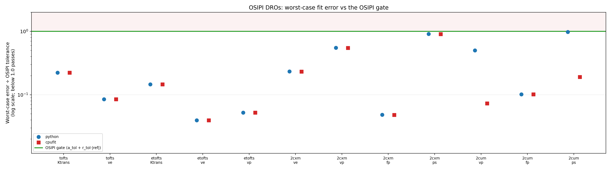

# OSIPI Verification

ROCKETSHIP's fitting routines are verified against an independent external standard with known
ground truth: the **Open Science Initiative for Perfusion Imaging (OSIPI)**, an ISMRM-led effort
that publishes reference data and a common framework for comparing perfusion software across
research groups.

This page sets out what that verification covers, how accuracy is judged, and the results. For
the rest of the automated test suite, see [Testing](testing.md).

## Why an external standard

Nonlinear model fitting is sensitive to implementation detail. A unit convention, an optimizer
setting, or a subtly miscoded model equation can shift estimated parameters by enough to change
a clinical conclusion, while the fit itself still converges and the curves still look
reasonable.

Testing such code against its own output demonstrates nothing, and comparing it against another
implementation only establishes that two pieces of software agree. Neither shows that the
recovered numbers are *correct*. Establishing that requires data whose true parameters are known
independently, and a threshold set by someone other than the authors of the software. That is
what the OSIPI framework provides.

## Digital reference objects

OSIPI publishes **digital reference objects** — synthetic concentration–time curves generated
from *known* kinetic parameters. Because the true answer is known exactly, fitting a DRO
measures absolute accuracy rather than agreement with another implementation.

The test suite fits these DROs with ROCKETSHIP's own routines and checks the recovered
parameters against OSIPI's published acceptance criteria. Coverage extends across the pipeline:

| Area | Verified against |
| --- | --- |
| Pharmacokinetic models | Tofts, extended Tofts, Patlak, two-compartment exchange (2CXM) and two-compartment uptake (2CUM) DROs |
| \(T_1\) mapping | Brain, QUIBA and prostate variable-flip-angle datasets |
| Signal to concentration | The OSIPI signal-to-concentration reference dataset |
| Fitting backends | The standard CPU path, and the CPUfit and GPUfit accelerated paths where available |

The DRO files committed to the repository are **byte-identical (verified by MD5) to the OSIPI
source**, so the verification is reproducible rather than resting on a transcription.

## How accuracy is judged

Two independent references are used, and the distinction between them matters.

**OSIPI acceptance tolerances — the pass/fail gate.** These are OSIPI's own per-parameter
tolerances, transcribed verbatim from its test suite, and are what every participating
implementation is checked against. Per the OSIPI publication they are deliberately *wide
validity checks*, intended to catch gross and unit errors and explicitly "not intended to
indicate an acceptable level of accuracy." Passing them means an implementation is free of
gross defects, not that it is the most accurate available.

**Peer implementation spread — context, not a gate.** The framework publishes the fitted
results of every contributing research group. Pooling those gives the spread of errors across
established perfusion software, which places ROCKETSHIP's error in the context of the field
rather than merely against a threshold.

The peer spread is reported but deliberately **not** used as a pass/fail bar, because for the
2CXM and 2CUM models the comparison is partly self-referential: ROCKETSHIP's implementations of
those models follow the same LEK/Edinburgh formulation that is also present in the peer pool,
so its error naturally tracks the peer figures closely for those two models.

## Results

{ loading=lazy }

Worst-case fit error for each model and parameter, expressed as a fraction of the OSIPI
tolerance that parameter is judged against. The gate is the green line at 1.0; anything below
it passes, and the shaded band above it is the failing region. Plotting the ratio rather than
the raw error puts parameters with different units on a single axis.

### Reading the table

Each backend entry is the **largest absolute deviation from ground truth** across every DRO
case for that parameter, in that parameter's own units, followed by **that deviation as a
percentage of the OSIPI tolerance**. Anything under 100% is inside the tolerance and passes.

The tolerance itself is not a single number per row: OSIPI defines it per case as
\(a_{tol} + r_{tol}\,|{\text{reference}}|\), so it varies with the true value being
recovered. The percentage is therefore quoted against the tolerance applying to the worst case,
which is what the gate actually tests. Peer maximum is an absolute error like the backend
columns, but carries no percentage because it is reported for context and is not gated.

Units follow the OSIPI digital reference object convention: \(v_e\) and \(v_p\) are
dimensionless volume fractions, \(K^{trans}\) and \(PS\) are per minute, and \(F_p\) is
mL/100 mL/min.

| Model | Parameter | Units | Standard CPU Error<br>(% of tol) | CPUfit Error<br>(% of tol) | Peer Max Error |
| --- | --- | --- | --- | --- | ---: |
| Tofts | \(K^{trans}\) | min⁻¹ | 0.00224 (22%) | 0.00224 (22%) | 0.00369 |
| Tofts | \(v_e\) | — | 0.00425 (8%) | 0.00425 (8%) | 0.00425 |
| Extended Tofts | \(K^{trans}\) | min⁻¹ | 0.00183 (15%) | 0.00183 (15%) | 0.00351 |
| Extended Tofts | \(v_e\) | — | 0.00197 (4%) | 0.00197 (4%) | 0.00751 |
| Extended Tofts | \(v_p\) | — | 0.00131 (5%) | 0.00131 (5%) | 0.00222 |
| Patlak | \(PS\) | min⁻¹ | 0.000379 (4%) | 0.000379 (4%) | 0.000479 |
| Patlak | \(v_p\) | — | 0.00177 (7%) | 0.00177 (7%) | 0.00198 |
| 2CXM | \(v_e\) | — | 0.0116 (23%) | 0.0116 (23%) | 0.0159 |
| 2CXM | \(v_p\) | — | 0.0138 (55%) | 0.0137 (55%) | 0.0186 |
| 2CXM | \(F_p\) | mL/100 mL/min | 0.435 (5%) | 0.434 (5%) | 1.94 |
| 2CXM | \(PS\) | min⁻¹ | 0.0182 (91%) | 0.0181 (91%) | 0.0186 |
| 2CUM | \(v_p\) | — | 0.0126 (50%) | 0.00183 (7%) | 0.0034 |
| 2CUM | \(F_p\) | mL/100 mL/min | 0.761 (10%) | 0.761 (10%) | 4.49 |
| 2CUM | \(PS\) | min⁻¹ | 0.0049 (98%) | 0.00143 (19%) | 0.00174 |

**Every backend passes the OSIPI gate on every model and parameter.** Worst-case error stays
inside the tolerance throughout. Measured against the field, the standard CPU path is at or
below the maximum of the published peer implementations on twelve of the fourteen parameters,
the exceptions being the two 2CUM parameters; the CPUfit path is at or below it on all
fourteen. Variable-flip-angle \(T_1\) mapping and the signal-to-concentration conversion pass
on the same basis.

!!! success "The accelerated backends are held to the same standard"
    The CPUfit and GPUfit paths are verified against OSIPI independently, not merely checked
    for agreement with the standard path, and they pass the full sweep on all five accelerated
    models. On the single-compartment models and on 2CXM their results match the standard path
    to three significant figures. On 2CUM the accelerated path is in fact the more accurate of
    the two, though both are comfortably inside the tolerance.

    Choosing acceleration is therefore a decision about speed, not a trade against accuracy.
    See [GPU and CPU Acceleration](wiki/enable-gpu-acceleration.md).

!!! note "Arterial delay is not fitted"
    The OSIPI DROs include variants with a five-second delay between the arterial and tissue
    curves. ROCKETSHIP does not currently fit arterial delay, so it does not recover these
    cases and they are excluded from the gate. The test suite still reports them, so the size
    of the gap stays visible rather than being silently omitted. Where your data has a
    substantial bolus arrival delay between the arterial region and the tissue of interest,
    this is a known limitation.

## Running the verification

```bash
.venv/bin/python -m pytest tests/python -m osipi -v
```

This runs the full sweep, including the complete 2CXM and 2CUM case sets. For a summary of
error against the OSIPI gate with the peer spread alongside:

```bash
.venv/bin/python tests/python/run_osipi_reliability.py --suite all
```

The accuracy report and figures above are regenerated with:

```bash
.venv/bin/python tests/data/osipi/reference/generate_osipi_summary.py
```

Full details of the reference data, its provenance, the tolerance files and the individual
tests are in
[tests/data/osipi/README.md](https://github.com/petmri/ROCKETSHIP/blob/master/tests/data/osipi/README.md).

## References

van Houdt, P.J., et al. [Reproducibility of DCE-MRI analysis: an ISMRM Open Science Initiative
for Perfusion Imaging (OSIPI) study](https://doi.org/10.1002/mrm.29826). *Magnetic Resonance in
Medicine* (2023). The OSIPI comparison framework.

Manning, C., et al. [Verification of a generalised framework for tracer kinetic
analysis](https://doi.org/10.1002/mrm.28833). *Magnetic Resonance in Medicine* (2021). The
pharmacokinetic digital reference objects.

Reference data and per-implementation results are drawn from the Apache-2.0 licensed
[OSIPI DCE-DSC-MRI_TestResults](https://github.com/OSIPI/DCE-DSC-MRI_TestResults) repository.
